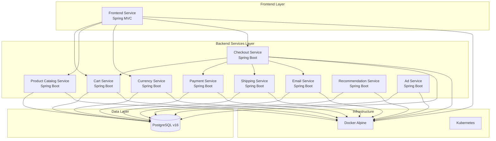

# 02-migration-plan.md - Diseño de Migración

## Resumen Ejecutivo

Este documento presenta el diseño completo de migración del proyecto Online Boutique desde su arquitectura actual de microservicios multi-lenguaje hacia una arquitectura unificada basada en **Java 17 LTS + Spring Boot + PostgreSQL v16 + Docker Alpine**. La migración preservará toda la funcionalidad existente mientras moderniza la stack tecnológica.

## Arquitectura Objetivo

### Stack Tecnológico Unificado
- **Lenguaje**: Java 17 LTS (Long Term Support)
- **Framework**: Spring Boot 3.2.x (estable y compatible con Java 17)
- **Base de Datos**: PostgreSQL v16 (única base de datos)
- **ORM**: Spring Data JPA + Hibernate 6.x
- **Migraciones**: Flyway 9.x
- **Contenedores**: Docker con base Alpine Linux
- **Build**: Maven 3.9.x
- **Observabilidad**: Micrometer + OpenTelemetry
- **Logging**: Logback con formato JSON estructurado

### Arquitectura de Microservicios Consolidada

```
┌─────────────────────────────────────────────────────────────┐
│                    Online Boutique                         │
│                 (Spring Boot Unified)                     │
├─────────────────────────────────────────────────────────────┤
│  Frontend Service     │  Backend Services                 │
│  (Spring MVC)         │  (Spring Boot Apps)               │
│  - Web UI             │  - Cart Service                   │
│  - Static Assets      │  - Product Catalog Service        │
│  - Session Mgmt       │  - Currency Service               │
│                       │  - Payment Service                │
│                       │  - Shipping Service               │
│                       │  - Email Service                  │
│                       │  - Checkout Service               │
│                       │  - Recommendation Service         │
│                       │  - Ad Service                     │
├─────────────────────────────────────────────────────────────┤
│                    PostgreSQL v16                          │
│  - products           │  - cart_items                     │
│  - currencies         │  - orders                         │
│  - users              │  - order_items                    │
│  - sessions           │  - recommendations                │
│  - ads                │  - shipping_quotes                │
└─────────────────────────────────────────────────────────────┘
```

### Diagrama de Componentes



## Plan de Trabajo Detallado

### Fase 1: Preparación y Diseño (Completada)
- ✅ Inventario completo del código fuente
- ✅ Análisis de arquitectura actual
- ✅ Diseño de arquitectura objetivo
- ✅ Definición de stack tecnológico

### Fase 2: Implementación Core (En Progreso)
1. **Configuración Base del Proyecto**
   - Estructura de directorios Maven multi-módulo
   - Configuración Spring Boot base
   - Configuración de base de datos PostgreSQL
   - Configuración de observabilidad

2. **Migración de Servicios Backend**
   - Product Catalog Service (prioridad alta)
   - Currency Service (prioridad alta)
   - Cart Service (prioridad alta)
   - Payment Service (prioridad media)
   - Shipping Service (prioridad media)
   - Email Service (prioridad media)
   - Checkout Service (prioridad alta)
   - Recommendation Service (prioridad baja)
   - Ad Service (prioridad baja)

3. **Migración del Frontend**
   - Conversión de Go a Spring MVC
   - Migración de templates HTML
   - Migración de assets estáticos
   - Implementación de manejo de sesiones

### Fase 3: Persistencia y Datos
1. **Diseño de Esquema PostgreSQL**
   - Tablas para productos, carritos, órdenes
   - Índices y constraints
   - Scripts de migración Flyway

2. **Migración de Datos**
   - Productos desde JSON a PostgreSQL
   - Tasas de cambio de monedas
   - Datos de ejemplo y seed

### Fase 4: Contenerización
1. **Dockerfiles Alpine**
   - Imagen base Java 17 Alpine
   - Configuración multi-stage builds
   - Optimización de tamaño

2. **Docker Compose**
   - Servicios locales
   - Configuración de desarrollo
   - Health checks

### Fase 5: Testing y QA
1. **Pruebas Unitarias**
   - Cobertura >70% backend
   - Pruebas de integración
   - Pruebas de contrato

2. **Pruebas de Migración**
   - Verificación de datos
   - Pruebas de consistencia
   - Smoke tests

### Fase 6: CI/CD y Despliegue
1. **Pipeline CI/CD**
   - Build automatizado
   - Tests automatizados
   - Despliegue automatizado

2. **Manifiestos Kubernetes**
   - Configuraciones de producción
   - Helm charts
   - ConfigMaps y Secrets

### Fase 7: Documentación y Entrega
1. **Manual de Implementación**
   - Guía paso a paso
   - Troubleshooting
   - Runbooks operacionales

## Mapping Archivo-a-Archivo

### Frontend Service
| Archivo Original | Archivo Migrado | Notas |
|------------------|-----------------|-------|
| `src/frontend/main.go` | `src/main/java/com/onlineboutique/frontend/FrontendApplication.java` | Clase principal Spring Boot |
| `src/frontend/handlers.go` | `src/main/java/com/onlineboutique/frontend/controller/` | Controladores Spring MVC |
| `src/frontend/rpc.go` | `src/main/java/com/onlineboutique/frontend/client/` | Clientes HTTP/REST |
| `src/frontend/middleware.go` | `src/main/java/com/onlineboutique/frontend/config/` | Configuración Spring |
| `src/frontend/money/money.go` | `src/main/java/com/onlineboutique/common/model/Money.java` | Modelo compartido |
| `src/frontend/validator/validator.go` | `src/main/java/com/onlineboutique/frontend/validation/` | Validaciones Spring |

### Cart Service
| Archivo Original | Archivo Migrado | Notas |
|------------------|-----------------|-------|
| `src/cartservice/src/Program.cs` | `src/main/java/com/onlineboutique/cart/CartApplication.java` | Clase principal |
| `src/cartservice/src/Startup.cs` | `src/main/java/com/onlineboutique/cart/config/` | Configuración Spring |
| `src/cartservice/src/services/CartService.cs` | `src/main/java/com/onlineboutique/cart/service/CartService.java` | Servicio de negocio |
| `src/cartservice/src/cartstore/ICartStore.cs` | `src/main/java/com/onlineboutique/cart/repository/CartRepository.java` | Repositorio JPA |
| `src/cartservice/src/cartstore/RedisCartStore.cs` | `src/main/java/com/onlineboutique/cart/entity/CartItem.java` | Entidad JPA |

### Product Catalog Service
| Archivo Original | Archivo Migrado | Notas |
|------------------|-----------------|-------|
| `src/productcatalogservice/server.go` | `src/main/java/com/onlineboutique/catalog/CatalogApplication.java` | Clase principal |
| `src/productcatalogservice/product_catalog.go` | `src/main/java/com/onlineboutique/catalog/service/ProductService.java` | Servicio de negocio |
| `src/productcatalogservice/catalog_loader.go` | `src/main/java/com/onlineboutique/catalog/config/DataLoader.java` | Carga de datos |
| `src/productcatalogservice/products.json` | `src/main/resources/data/products.json` | Datos de productos |

### Currency Service
| Archivo Original | Archivo Migrado | Notas |
|------------------|-----------------|-------|
| `src/currencyservice/server.js` | `src/main/java/com/onlineboutique/currency/CurrencyApplication.java` | Clase principal |
| `src/currencyservice/data/currency_conversion.json` | `src/main/resources/data/currencies.json` | Datos de monedas |

### Payment Service
| Archivo Original | Archivo Migrado | Notas |
|------------------|-----------------|-------|
| `src/paymentservice/server.js` | `src/main/java/com/onlineboutique/payment/PaymentApplication.java` | Clase principal |
| `src/paymentservice/charge.js` | `src/main/java/com/onlineboutique/payment/service/PaymentService.java` | Servicio de negocio |

### Shipping Service
| Archivo Original | Archivo Migrado | Notas |
|------------------|-----------------|-------|
| `src/shippingservice/main.go` | `src/main/java/com/onlineboutique/shipping/ShippingApplication.java` | Clase principal |
| `src/shippingservice/quote.go` | `src/main/java/com/onlineboutique/shipping/service/ShippingService.java` | Servicio de negocio |
| `src/shippingservice/tracker.go` | `src/main/java/com/onlineboutique/shipping/util/TrackingUtil.java` | Utilidades |

### Email Service
| Archivo Original | Archivo Migrado | Notas |
|------------------|-----------------|-------|
| `src/emailservice/email_server.py` | `src/main/java/com/onlineboutique/email/EmailApplication.java` | Clase principal |
| `src/emailservice/templates/confirmation.html` | `src/main/resources/templates/confirmation.html` | Template Thymeleaf |

### Checkout Service
| Archivo Original | Archivo Migrado | Notas |
|------------------|-----------------|-------|
| `src/checkoutservice/main.go` | `src/main/java/com/onlineboutique/checkout/CheckoutApplication.java` | Clase principal |
| `src/checkoutservice/money/money.go` | `src/main/java/com/onlineboutique/common/model/Money.java` | Modelo compartido |

### Recommendation Service
| Archivo Original | Archivo Migrado | Notas |
|------------------|-----------------|-------|
| `src/recommendationservice/recommendation_server.py` | `src/main/java/com/onlineboutique/recommendation/RecommendationApplication.java` | Clase principal |

### Ad Service
| Archivo Original | Archivo Migrado | Notas |
|------------------|-----------------|-------|
| `src/adservice/src/main/java/hipstershop/AdService.java` | `src/main/java/com/onlineboutique/ad/AdApplication.java` | Clase principal |

## Decisiones Tecnológicas

### Versión Java: Java 17 LTS
**Justificación**: 
- Versión LTS con soporte extendido hasta 2029
- Compatible con Spring Boot 3.x
- Mejoras de rendimiento significativas
- Soporte completo para Alpine Linux

### Versión Spring Boot: 3.2.x
**Justificación**:
- Estable y compatible con Java 17
- Soporte nativo para GraalVM (opcional)
- Mejoras en observabilidad
- Soporte completo para OpenTelemetry

### Base de Datos: PostgreSQL v16
**Justificación**:
- Base de datos relacional robusta
- Soporte completo para JSON (productos)
- Índices avanzados para búsquedas
- Compatible con Alpine Linux

### ORM: Spring Data JPA + Hibernate 6.x
**Justificación**:
- Integración nativa con Spring Boot
- Soporte completo para PostgreSQL
- Caché de segundo nivel
- Validaciones automáticas

### Migraciones: Flyway 9.x
**Justificación**:
- Integración nativa con Spring Boot
- Versionado automático de esquemas
- Rollback automático
- Soporte para datos de ejemplo

### Logging: Logback + SLF4J
**Justificación**:
- Integración nativa con Spring Boot
- Configuración flexible
- Soporte para formato JSON
- Performance optimizada

### Observabilidad: Micrometer + OpenTelemetry
**Justificación**:
- Integración nativa con Spring Boot
- Métricas estándar
- Tracing distribuido
- Compatible con Prometheus/Grafana

### Build: Maven 3.9.x
**Justificación**:
- Estándar de la industria Java
- Soporte completo para Spring Boot
- Gestión de dependencias robusta
- Integración con CI/CD

### Contenedores: Docker Alpine
**Justificación**:
- Imágenes pequeñas y seguras
- Soporte oficial para Java 17
- Compatible con Kubernetes
- Optimización de recursos

## Estrategia de Datos

### Migración de Productos
```sql
-- Tabla productos
CREATE TABLE products (
    id VARCHAR(50) PRIMARY KEY,
    name VARCHAR(255) NOT NULL,
    description TEXT,
    picture VARCHAR(500),
    price_usd_units BIGINT NOT NULL,
    price_usd_nanos INTEGER NOT NULL,
    categories JSONB,
    created_at TIMESTAMP DEFAULT CURRENT_TIMESTAMP,
    updated_at TIMESTAMP DEFAULT CURRENT_TIMESTAMP
);

-- Índices para búsqueda
CREATE INDEX idx_products_categories ON products USING GIN (categories);
CREATE INDEX idx_products_name ON products (name);
```

### Migración de Monedas
```sql
-- Tabla tasas de cambio
CREATE TABLE currency_rates (
    currency_code VARCHAR(3) PRIMARY KEY,
    rate_to_eur DECIMAL(20,8) NOT NULL,
    updated_at TIMESTAMP DEFAULT CURRENT_TIMESTAMP
);
```

### Migración de Carrito
```sql
-- Tabla carrito
CREATE TABLE cart_items (
    id BIGSERIAL PRIMARY KEY,
    user_id VARCHAR(255) NOT NULL,
    product_id VARCHAR(50) NOT NULL,
    quantity INTEGER NOT NULL,
    created_at TIMESTAMP DEFAULT CURRENT_TIMESTAMP,
    updated_at TIMESTAMP DEFAULT CURRENT_TIMESTAMP,
    UNIQUE(user_id, product_id)
);

-- Índices
CREATE INDEX idx_cart_items_user_id ON cart_items (user_id);
CREATE INDEX idx_cart_items_product_id ON cart_items (product_id);
```

### Migración de Órdenes
```sql
-- Tabla órdenes
CREATE TABLE orders (
    id VARCHAR(255) PRIMARY KEY,
    user_id VARCHAR(255) NOT NULL,
    user_currency VARCHAR(3) NOT NULL,
    shipping_address JSONB NOT NULL,
    email VARCHAR(255) NOT NULL,
    credit_card_info JSONB NOT NULL,
    total_amount_units BIGINT NOT NULL,
    total_amount_nanos INTEGER NOT NULL,
    shipping_cost_units BIGINT NOT NULL,
    shipping_cost_nanos INTEGER NOT NULL,
    shipping_tracking_id VARCHAR(255),
    status VARCHAR(50) DEFAULT 'PENDING',
    created_at TIMESTAMP DEFAULT CURRENT_TIMESTAMP,
    updated_at TIMESTAMP DEFAULT CURRENT_TIMESTAMP
);

-- Tabla items de orden
CREATE TABLE order_items (
    id BIGSERIAL PRIMARY KEY,
    order_id VARCHAR(255) NOT NULL,
    product_id VARCHAR(50) NOT NULL,
    quantity INTEGER NOT NULL,
    price_units BIGINT NOT NULL,
    price_nanos INTEGER NOT NULL,
    FOREIGN KEY (order_id) REFERENCES orders(id)
);
```

## Criterios de Aceptación por Módulo

### Frontend Service
- [ ] Todos los endpoints HTTP funcionan correctamente
- [ ] Templates HTML se renderizan correctamente
- [ ] Assets estáticos se sirven correctamente
- [ ] Manejo de sesiones funciona
- [ ] Integración con servicios backend funciona
- [ ] Health check responde correctamente

### Cart Service
- [ ] CRUD de carrito funciona correctamente
- [ ] Persistencia en PostgreSQL funciona
- [ ] Validaciones de entrada funcionan
- [ ] Manejo de concurrencia funciona
- [ ] Health check responde correctamente

### Product Catalog Service
- [ ] Listado de productos funciona
- [ ] Búsqueda de productos funciona
- [ ] Filtrado por categorías funciona
- [ ] Carga de datos desde JSON funciona
- [ ] Health check responde correctamente

### Currency Service
- [ ] Conversión de monedas funciona
- [ ] Listado de monedas soportadas funciona
- [ ] Tasas de cambio se cargan correctamente
- [ ] Health check responde correctamente

### Payment Service
- [ ] Procesamiento de pagos funciona
- [ ] Validación de tarjetas funciona
- [ ] Generación de transacciones funciona
- [ ] Health check responde correctamente

### Shipping Service
- [ ] Cálculo de cotizaciones funciona
- [ ] Generación de tracking IDs funciona
- [ ] Procesamiento de envíos funciona
- [ ] Health check responde correctamente

### Email Service
- [ ] Envío de emails funciona
- [ ] Templates HTML se procesan correctamente
- [ ] Integración con servicios de email funciona
- [ ] Health check responde correctamente

### Checkout Service
- [ ] Orquestación de checkout funciona
- [ ] Integración con todos los servicios funciona
- [ ] Manejo de transacciones funciona
- [ ] Health check responde correctamente

### Recommendation Service
- [ ] Algoritmo de recomendaciones funciona
- [ ] Integración con carrito funciona
- [ ] Health check responde correctamente

### Ad Service
- [ ] Generación de anuncios funciona
- [ ] Análisis de contexto funciona
- [ ] Health check responde correctamente

## Riesgos y Mitigaciones

### Riesgo 1: Pérdida de Funcionalidad
**Mitigación**: 
- Pruebas exhaustivas de cada endpoint
- Validación de contratos de API
- Pruebas de integración completas

### Riesgo 2: Problemas de Rendimiento
**Mitigación**:
- Pruebas de carga
- Optimización de consultas SQL
- Caché de segundo nivel

### Riesgo 3: Problemas de Compatibilidad
**Mitigación**:
- Testing en múltiples entornos
- Validación de imágenes Docker
- Pruebas de integración

### Riesgo 4: Migración de Datos
**Mitigación**:
- Scripts de migración probados
- Validación de integridad de datos
- Rollback automático

## Próximos Pasos

1. **Configuración del Proyecto Base**
   - Crear estructura Maven multi-módulo
   - Configurar Spring Boot base
   - Configurar PostgreSQL y Flyway

2. **Implementación de Servicios Core**
   - Product Catalog Service
   - Currency Service
   - Cart Service

3. **Migración de Datos**
   - Scripts Flyway
   - Datos de ejemplo
   - Validación de integridad

4. **Testing y Validación**
   - Pruebas unitarias
   - Pruebas de integración
   - Pruebas de carga

5. **Contenerización**
   - Dockerfiles Alpine
   - Docker Compose
   - Optimización de imágenes

Este plan de migración asegura una transición completa y exitosa del proyecto Online Boutique hacia la nueva arquitectura unificada, manteniendo toda la funcionalidad existente mientras moderniza la stack tecnológica.
